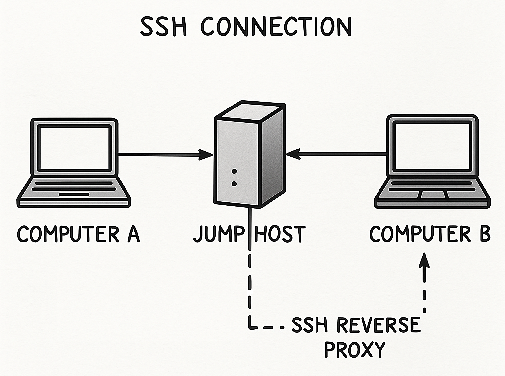

# Remote System Access via SSH (Server Setup Focus)



This document details the server-side setup for establishing remote SSH access to a client machine via a jump host, using a reverse SSH proxy.

## 1\. Server Setup: Jump Host Configuration

The jump host acts as an intermediary for establishing the reverse SSH tunnel.

  * **Run the `ssh-proxy_server` Docker image.** https://github.com/MirAI-Tech-Dev/remote-connect

  * **Default Username:** The image uses a default username for the reverse proxy: `backflip`.

  * **Add Client Key to `authorized_keys`:** The client's public SSH key must be added to `/home/backflip/.ssh/authorized_keys` on the jump host.

    The `authorized_keys` entry should be configured to only allow tunnel setup (specifically on port 2222) and prevent direct command execution or login shells. An example configuration is:

    ```
    command="",restrict,port-forwarding,permitopen="localhost:2222" ssh-ed25519 AAAAC3NzaC1lZDI1NTE5AAAAIBcgKNOj/IeWHZ5Q3q87dBiS9EyU70jJi8O8idqoNWhO matthias@my-test
    ```

    You can add or modify this entry by connecting to the jump host and using `nano`:

    ```bash
    ssh remote-connect-login -l backflip -t -- nano .ssh/authorized_keys
    ```

## 2\. Obtain the Public Key from the Client

Instruct the client to provide their public SSH key. They can typically do this using one of the following commands:

  * For RSA keys: `cat ${HOME}/.ssh/id_rsa.pub`
  * For ED25519 keys (newer systems): `cat ${HOME}/.ssh/id_ed25519.pub`

## 3\. Create SSH Key Pair on Client (if missing)

If the client does not have an SSH key pair, they should generate one using:

```bash
ssh-keygen
```

**Important:** Advise the client not to enter a password when prompted during key creation.

## 4\. Create a Tunnel from the Client Machine

The client machine will establish a reverse tunnel to the jump host (`ssh-proxy_server` container). This command opens a tunnel that forwards connections from a specified port on the jump host (`R_PORT`) to port 22 on the client's `localhost`.

```bash
SSH_PROXY=SSH_PROXY_IP_OR_NAME
R_PORT=2222
ssh ${SSH_PROXY} -p 11111 -l backflip -R ${R_PORT}:localhost:22 -N -T -v
```

**Optional: Add Jump Host to Client's `ssh_config`**
To simplify the client-side tunnel command, the client can add the following to their `~/.ssh/config` file:

```
host rev-proxy
    ForwardAgent yes
    hostname SSH_PROXY_IP_OR_NAME
    user backflip
    port 11111
```

With this configuration, the tunnel can be initiated using:

```bash
R_PORT=2222
ssh rev-proxy -R ${R_PORT}:localhost:22 -N -T -v
```

## 5\. Connect to the Client from an Authorized Machine

Once the tunnel is established, an authorized machine can connect to the client. The machine initiating this connection must have its SSH key authorized by the jump host.

```bash
JMPBOX=backflip@SSH_PROXY_IP_OR_NAME:11111
USER_CLIENT=andrew
R_PORT=2222
ssh -J ${JMPBOX} -p ${R_PORT} -l ${USER_CLIENT} localhost
```

**Optional: Add Reverse Tunnel Connect to `ssh_config`**
To streamline connections to the client, add the following to the authorized machine's `~/.ssh/config`:

```
host rev-proxy-connect
    ForwardAgent yes
    hostname localhost
    #user USER_CLIENT
    port 2222
    ProxyJump rev-proxy
    StrictHostKeyChecking accept-new
    UserKnownHostsFile=/dev/null
```

After this configuration, connect to the client simply by:

```bash
ssh rev-proxy-connect -l USER_CLIENT
```

<!-- ## 6\. Other Resources

For additional options, refer to: [https://www.huuphan.com/2024/12/remote-ssh-access-behind-firewall.html](https://www.huuphan.com/2024/12/remote-ssh-access-behind-firewall.html) -->