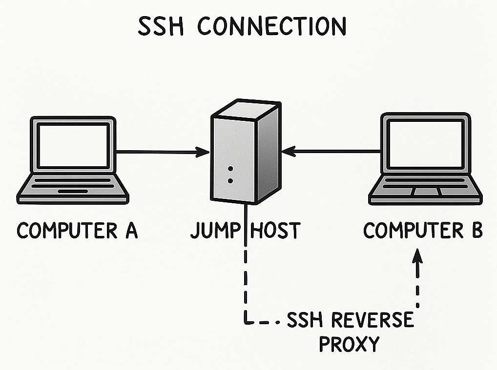

# SSH remote connect behind firewall

{: width="80%"}

This document outlines the steps to establish an SSH reverse tunnel for remote access to a client machine located behind a firewall, using a jump host (proxy server).

## 1\. Obtain the Client's Public SSH Key

Retrieve the public key from the client machine. Use one of the following commands:

* For RSA keys: `cat ${HOME}/.ssh/id_rsa.pub`
* For ED25519 keys (newer systems): `cat ${HOME}/.ssh/id_ed25519.pub`

## 2\. Add Public Key to the Jump Host (Server Setup)

The administrator must add the client's public key to the jump host. This key is typically added to `/home/backflip/.ssh/authorized_keys` on the `ssh-proxy_server` container.

The entry in `authorized_keys` should restrict the connection to tunnel setup only, preventing command execution or login shells. An example entry looks like this:

```
command="",restrict,port-forwarding,permitopen="localhost:2222" ssh-ed25519 AAAAC3NzaC1lZDI1NTE5AAAAIBcgKNOj/IeWHZ5Q3q87dBiS9EyU70jJi8O8idqoNWhO matthias@my-test
```

You can edit the `authorized_keys` file on the jump host using:

```bash
ssh remote-connect-login -l backflip -t -- nano .ssh/authorized_keys
```

### Create SSH Key Pair (if missing on client)

If the client machine lacks an SSH key pair, generate one using:

```bash
ssh-keygen
```

**Important:** Do not enter a password when prompted during key creation.

## 3. Add the Remote Machine's Public SSH key to the Client Machine

Use your favourite editor and add the key to `${HOME}/.ssh/authorized_keys`.
```
ssh-ed25519 AAAAC3NzaC1lZDI1NTE5AAAAIMYNvt3ON4Xf6NplwkhVui9YzVsw3fjOIxZxp7GfTmqv remote-connect@miraitech
```
Make sure the file has the correct permissions:
```
chmod 600 ${HOME}/.ssh/authorized_keys
```

## 4. Establish a Reverse Tunnel from the Client Machine

From the client machine, create a reverse tunnel to the jump host. This tunnel will forward traffic from a specified port on the jump host to port 22 (SSH) on the client's localhost.

```bash
SSH_PROXY=remote-connect.miraitech.solutions
R_PORT=2222
ssh ${SSH_PROXY} -p 11111 -l backflip -R ${R_PORT}:localhost:22 -N -T -v
```

**Optional: Add Jump Host to `ssh_config`**
To simplify the tunnel command, add the jump host details to your client's `~/.ssh/config` file:

```
host rev-proxy
    ForwardAgent yes
    hostname SSH_PROXY_IP_OR_NAME
    user backflip
    port 11111
```

Then, you can initiate the tunnel with:

```bash
R_PORT=2222
ssh rev-proxy -R ${R_PORT}:localhost:22 -N -T -v
```

## 5\. Connect to the Client from an Authorized Machine

To connect to the client machine, your local machine must be authorized by the jump host (i.e., its SSH key must be added to the jump host's `authorized_keys` for connection purposes).

```bash
JMPBOX=backflip@remote-connect.miraitech.solutions:11111
USER_CLIENT=matthias
R_PORT=2222
ssh -J ${JMPBOX} -p ${R_PORT} -l ${USER_CLIENT} localhost
```

**Optional: Add Reverse Tunnel Connection to `ssh_config`**
For easier connections, add the following configuration to your `~/.ssh/config` on the authorized machine:

```
host rev-proxy-connect
    ForwardAgent yes
    hostname localhost
    #user USER_CLIENT
    port 2222
    ProxyJump rev-proxy
    StrictHostKeyChecking accept-new
    UserKnownHostsFile=/dev/null
```

Then, connect simply by:

```bash
ssh rev-proxy-connect -l USER_CLIENT
```
